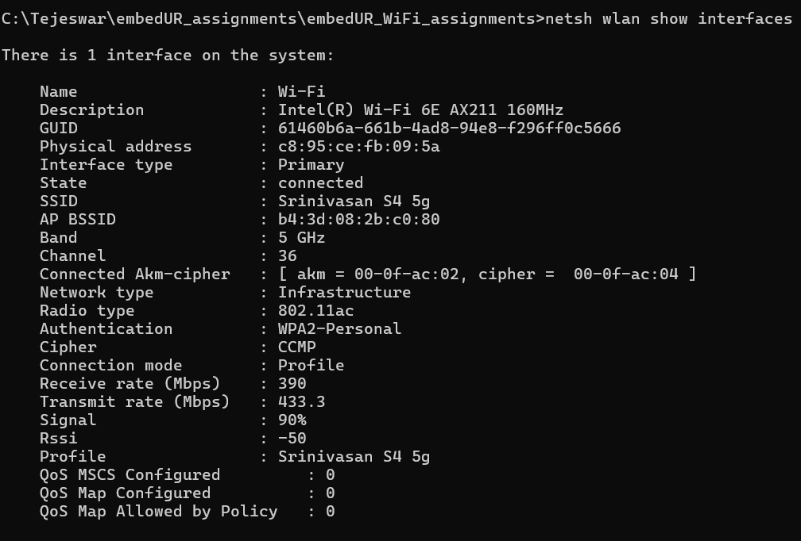
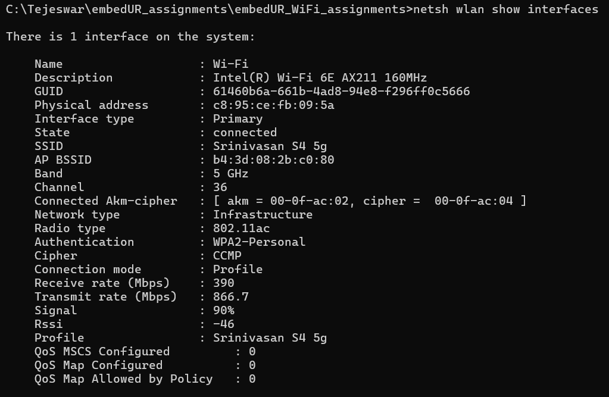
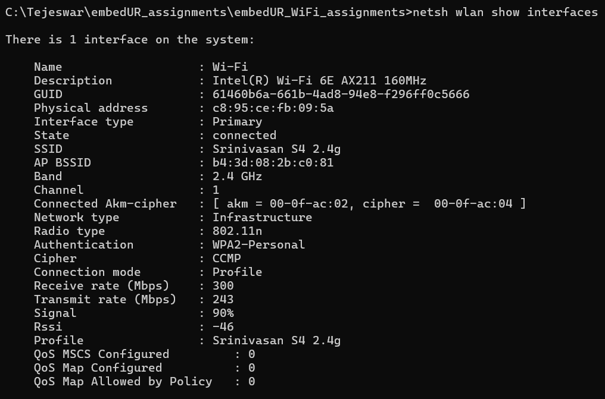

# Assignment Questions – Module 1

## 1. In which OSI layer the Wi-Fi standard/protocol fits.

### Answer:
Wi-Fi (based on IEEE 802.11) operates in the lower two layers of the OSI model:

####  OSI Layers where Wi-Fi fits
1.  Layer 1 – Physical Layer (PHY)
Handles actual transmission of signals over the air
Defines:
Frequencies (2.4 GHz, 5 GHz, 6 GHz)
Modulation techniques (OFDM, QAM)
Data rates

This is where bits are converted into radio waves

2. Layer 2 – Data Link Layer (MAC sublayer)
Manages how devices access the medium
Handles:
MAC addressing
Frame formatting
Error detection (CRC)
Channel access (CSMA/CA)

This ensures reliable communication between devices on the same network

Key Point
Wi-Fi does NOT operate in higher layers (like IP, TCP, applications)
It only provides the link-level connectivity, while protocols like IP run above it

## 2. Can you share the Wi-Fi devices that you are using day to day life, share that device’s wireless capability/properties after connecting to network. Match your device to corresponding Wi-Fi Generations based on properties

### Answer:

### Windows: Command Prompt (best for assignment)

Run:
```
netsh wlan show interfaces
```
Key fields: Radio type (standard), Receive/Transmit rate, Channel → frequency channel, Signal strength



### Linux: 

Run
```
iw dev
```


## 3. what is BSS and ESS?

### Answer
### BSS (Basic Service Set)
#### Definition

A BSS is the smallest unit of a Wi-Fi network—it consists of:

One Access Point (AP)
Multiple connected devices (stations)

#### Key characteristics
1. Identified by a BSSID (AP’s MAC address)
2. Covers a limited area (range of one router)
3. All devices communicate through the AP

#### Example

Your home router + your phone + your laptop = one BSS

### ESS (Extended Service Set)
#### Definition

An ESS is formed by multiple BSSs connected together to act as a single large network.

#### Key characteristics
1. Multiple APs (each = one BSS)
2. All share the same SSID
3. Connected via a distribution system (usually wired LAN)
4. Supports roaming (devices move without disconnecting)
#### Example

In an office building:

Floor 1 AP → BSS1
Floor 2 AP → BSS2
Floor 3 AP → BSS3

All broadcast:

SSID = "Office_WiFi"

Together, they form an ESS

## 4. what are the basic functionalities of Wi-Fi Accesspoint

### Answer
**Basic functionalities of a Wi-Fi Access Point (AP)** 

1. **Wireless Connectivity (Radio Interface)**
   Provides RF interface for devices to connect over 2.4/5/6 GHz bands.

2. **Beacon Transmission**
   Periodically broadcasts network information (SSID, capabilities, security type) so clients can discover the network.

3. **Authentication and Association**
   Handles client connection process:

   * Authentication (identity check)
   * Association (joining the network)

4. **Frame Bridging (Wireless ↔ Wired)**
   Forwards data frames between wireless clients and the wired LAN (Ethernet backhaul).

5. **Medium Access Control (MAC Coordination)**
   Manages how devices share the wireless medium using CSMA/CA to avoid collisions.

6. **Data Transmission and Reception**
   Sends and receives frames to/from multiple clients, including handling acknowledgments and retransmissions.

7. **Security Enforcement**
   Implements encryption and access control (WPA2/WPA3), key management, and client isolation if configured.

8. **Traffic Management**
   Handles buffering, prioritization (QoS), and scheduling of packets for efficient communication.

9. **Roaming Support**
   Enables seamless handoff of clients between multiple APs within the same ESS.

10. **Channel and Power Management**
    Operates on specific channels and adjusts transmit power to optimize coverage and reduce interference.

11. **Multi-user Support**
    Supports multiple clients simultaneously (via mechanisms like MU-MIMO, OFDMA in newer standards).

12. **Monitoring and Control**
    Tracks connected devices, signal strength, and network performance; provides management interfaces.

These functions together allow an AP to act as the central coordinator for wireless communication in a network.

## 5. Difference between Bridge mode and Repeater mode
### Answer

### Difference between Bridge Mode and Repeater Mode in Wi-Fi


| Feature            | Bridge Mode                                      | Repeater Mode                                      |
|-------------------|--------------------------------------------------|----------------------------------------------------|
| Definition        | Connects two networks at Layer 2                 | Extends an existing Wi-Fi network                  |
| Purpose           | Network interconnection                          | Coverage extension                                 |
| Operation         | Acts as a transparent bridge between networks    | Receives and retransmits Wi-Fi signals             |
| Client Access     | No direct client connection                      | Clients connect through the repeater               |
| SSID Broadcast    | Does not broadcast a new SSID                    | Broadcasts same or extended SSID                   |
| Throughput Impact | Minimal loss                                     | Reduced (due to retransmission overhead)           |
| Backhaul          | Wired or dedicated wireless link                 | Wireless                                           |
| Deployment        | Requires configuration on both ends              | Simple and easy to deploy                          |
| Use Case          | Building-to-building or LAN-to-LAN connection    | Extending Wi-Fi range in homes/offices             |

## 6. what are the differences between 802.11a and 802.11b.
### Answer
### Differences between 802.11a and 802.11b (IEEE 802.11)

| Feature                     | 802.11a                                                                 | 802.11b                                                                 |
|----------------------------|-------------------------------------------------------------------------|-------------------------------------------------------------------------|
| Year of Standardization    | 1999                                                                    | 1999                                                                    |
| Frequency Band             | 5 GHz                                                                   | 2.4 GHz                                                                 |
| Maximum Data Rate          | Up to 54 Mbps                                                           | Up to 11 Mbps                                                           |
| Modulation Technique       | OFDM (Orthogonal Frequency Division Multiplexing)                       | DSSS (Direct Sequence Spread Spectrum) / CCK                            |
| Channel Bandwidth          | 20 MHz                                                                  | 20 MHz                                                                  |
| Number of Non-overlapping Channels | More (due to 5 GHz spectrum availability)                       | Limited (typically 3 non-overlapping channels: 1, 6, 11)                |
| Range (Coverage)           | Shorter range due to higher frequency                                   | Longer range due to lower frequency                                     |
| Penetration Capability     | Poor wall penetration                                                   | Better wall penetration                                                 |
| Interference               | Less interference (less crowded band)                                   | More interference (shared with Bluetooth, microwaves, etc.)            |
| Device Cost (historical)   | Higher (initially more expensive hardware)                              | Lower (widely adopted and cheaper)                                      |
| Adoption                   | Less popular initially due to cost and range limitations                | Widely adopted due to cost-effectiveness and better coverage            |
| Compatibility              | Not compatible with 802.11b                                             | Not compatible with 802.11a                                             |
| Typical Use Cases          | Enterprise environments, high-density deployments                       | Home and small office networks                                          |

### Summary

- 802.11a provides higher speed and less interference but operates at 5 GHz, resulting in shorter range.
- 802.11b offers lower speed but better range and wider adoption due to operation in the 2.4 GHz band.

## 7. Configure your modem/hotspot to operate only in 2.4Ghz and connect your laptop/Wi-Fi device, and capture the capability/properties in your Wi-Fi device. Repeat the same in 5Ghz and tabulate all the differences you observed during this

### Answer

### Configuration and Observation Procedure (2.4 GHz vs 5 GHz)

### Part A: Configure Router/Hotspot Band

#### Method 1: Using Wi-Fi Router (Modem)

1. Open a browser and go to router login page  
   - Common IPs: `192.168.0.1` or `192.168.1.1`  
2. Login using admin credentials  
3. Navigate to **Wireless Settings**  
4. You will see options like:
   - 2.4 GHz band
   - 5 GHz band  
5. Configure as follows:

**For 2.4 GHz only:**
- Disable 5 GHz band  
- Enable only 2.4 GHz  
- Save settings and reboot if required  

**For 5 GHz only:**
- Disable 2.4 GHz band  
- Enable only 5 GHz  
- Save settings and reboot  


#### Method 2: Using Mobile Hotspot (Android)

1. Go to **Settings → Hotspot / Tethering → Wi-Fi Hotspot**  
2. Open **Hotspot settings / Configure hotspot**  
3. Look for **AP Band / Hotspot Band**  
4. Select:
   - **2.4 GHz band** → for first test  
   - **5 GHz band** → for second test  
5. Turn hotspot ON  


### Part B: Connect Device

1. On your laptop/device, connect to the configured Wi-Fi network  
2. Ensure only one band is active to avoid confusion  


### Part C: Capture Wi-Fi Properties

#### On Windows (Recommended)

Run in Command Prompt:

```
netsh wlan show interfaces

```

Record the following:
- SSID  
- BSSID  
- Radio type (802.11n/ac/ax)  
- Band / Channel  
- Receive rate (Mbps)  
- Transmit rate (Mbps)  
- Signal strength  



5 Hz Connection



2.5Ghz Connection


#### On Ubuntu

Run:

```
iw dev wlan0 link
```

Record:
- SSID  
- BSSID  
- Frequency (MHz)  
- Channel  
- Signal strength  
- Bitrate  


### Part D: Tabulate Observations


| Parameter        | 2.4 GHz Observation | 5 GHz Observation |
|----------------|--------------------|-------------------|
| Frequency       |         2.4Ghz     |        5Ghz       |
| Channel         |          1         |       36          |
| Receive rate (Mbps) |         300           |       390            |
| Transmit rate (Mbps) |        243            |         866.7          |
| Signal Strength |          90%          |          90%         |
| Radio Type (Standard) |        802.11n        |        802.11ac           |
---

### Expected Differences (General)

- 2.4 GHz:
  - Better range  
  - Lower speed  
  - More interference  

- 5 GHz:
  - Higher speed  
  - Lower range  
  - Less interference  

## 8. What is the difference between IEEE and WFA 
### Answer
### Difference between IEEE and WFA

### IEEE (Institute of Electrical and Electronics Engineers)
- A global standards organization responsible for developing technical standards  
- Defines the **Wi-Fi protocol specifications** under :contentReference[oaicite:0]{index=0}  
- Focuses on **how the technology works** (PHY and MAC layers)  
- Publishes detailed technical documents and amendments  
- Ensures interoperability at the protocol/design level  
- Covers a wide range of technologies beyond Wi-Fi (Ethernet, Bluetooth, etc.)  

---

### WFA (Wi-Fi Alliance)
- An industry consortium of companies focused on Wi-Fi ecosystem  
- Responsible for **certification and branding of Wi-Fi products**  
- Uses IEEE standards but ensures **real-world interoperability between devices**  
- Provides certifications like:
  - Wi-Fi CERTIFIED  
  - Wi-Fi 5 / Wi-Fi 6 / Wi-Fi 6E naming  
- Focuses on **user experience, compatibility, and performance testing**  
- Defines additional features and test programs (e.g., WPA2, WPA3 certification)

---

### Key Differences

| Feature            | IEEE                                   | WFA (Wi-Fi Alliance)                  |
|-------------------|----------------------------------------|---------------------------------------|
| Full Form         | Institute of Electrical and Electronics Engineers | Wi-Fi Alliance                        |
| Role              | Standards development                  | Certification and interoperability     |
| Focus             | Technical specifications               | Product validation and branding        |
| Output            | Protocol standards (e.g., 802.11)      | Certified devices and Wi-Fi branding   |
| Scope             | Broad (many technologies)              | Focused on Wi-Fi ecosystem             |
| End Users         | Engineers, researchers                | Consumers and device manufacturers     |
---


## 9. List down the type of Wi-Fi internet connectivity backhaul, share your home/college's wireless internet connectivity backhaul name and its properties

### Answer
### Types of Wi-Fi Internet Connectivity Backhaul

Backhaul is the **link that connects a Wi-Fi access point/router to the internet (ISP network)**.

### 1. Fiber (FTTH/FTTP)

* Medium: Optical fiber
* Very high speed (100 Mbps to multi-Gbps)
* Very low latency
* High reliability and stability
* Common in modern homes and campuses


### 2. DSL (Digital Subscriber Line)

* Medium: Telephone copper lines
* Moderate speed (up to ~100 Mbps, often lower)
* Higher latency than fiber
* Distance-dependent performance


### 3. Cable Broadband

* Medium: Coaxial cable (TV lines)
* High speed (100 Mbps to 1 Gbps)
* Shared bandwidth among users
* Moderate latency


### 4. Cellular Backhaul (4G/5G Hotspot)

* Medium: Cellular network
* Speed varies widely (10 Mbps to >1 Gbps for 5G)
* Higher latency than fiber
* Used in mobile hotspots and backup connections


### 5. Fixed Wireless (Point-to-Point / Point-to-Multipoint)

* Medium: Wireless radio links
* Used by ISPs in rural or campus deployments
* Requires line-of-sight
* Speed depends on link quality and technology


### 6. Satellite Internet

* Medium: Satellite communication
* Wide coverage (remote areas)
* High latency (especially GEO satellites)
* Moderate speeds


### Backhaul Type: Fiber (FTTH)

* ISP Type: Fiber broadband
* Medium: Optical fiber
* Speed Plan: 100–300 Mbps (typical)
* Latency: Low (5–20 ms)
* Reliability: High
* Symmetry: Often symmetric (equal upload/download)
* Usage: Streaming, video calls, IoT, cloud access


### Tabular Summary

| Backhaul Type  | Medium           | Speed       | Latency | Reliability | Use Case           |
| -------------- | ---------------- | ----------- | ------- | ----------- | ------------------ |
| Fiber          | Optical fiber    | Very High   | Low     | High        | Home, enterprise   |
| DSL            | Copper line      | Medium      | Medium  | Medium      | Legacy broadband   |
| Cable          | Coaxial          | High        | Medium  | Medium      | Urban broadband    |
| Cellular       | Wireless (4G/5G) | Variable    | Medium  | Variable    | Hotspot, backup    |
| Fixed Wireless | Radio link       | Medium-High | Low     | Medium      | Rural/campus links |
| Satellite      | Satellite        | Medium      | High    | Medium      | Remote areas       |
---

## 10. List down the Wi-Fi topologies and use cases of each one.
### Answer
## Wi-Fi Topologies and Their Use Cases

*(based on IEEE 802.11)*

---

## 1. Infrastructure Mode (Basic Service Set – BSS)

### Description

* The most common Wi-Fi topology
* Consists of:

  * One **Access Point (AP)**
  * Multiple client devices (stations)
* All communication happens **through the AP** (not directly between clients)

### How it works

* AP acts as a **central coordinator**
* Devices associate with the AP and exchange data via it
* AP connects to a **wired network (backhaul)** for internet access

### Characteristics

* Centralized control
* Easier management and security
* Limited coverage (single AP range)

### Use Cases

* Home Wi-Fi networks
* Small offices
* Cafes, shops

---

## 2. Extended Service Set (ESS)

### Description

* Multiple **BSS networks connected together**
* All APs share the same **SSID**
* Provides **seamless roaming**

### How it works

* Each AP forms its own BSS
* All APs are connected via a **distribution system (usually Ethernet)**
* Devices switch between APs automatically

### Characteristics

* Large coverage area
* Supports mobility (roaming)
* Centralized network identity

### Use Cases

* Office buildings
* College campuses
* Hospitals, airports

---

## 3. Ad-Hoc Mode (Independent BSS – IBSS)

### Description

* Devices connect **directly to each other**
* No Access Point involved

### How it works

* Each device communicates peer-to-peer
* One device may act as a temporary coordinator

### Characteristics

* Simple and quick setup
* No infrastructure required
* Limited scalability and security

### Use Cases

* Temporary file sharing
* Device-to-device communication
* Emergency or quick setup networks

---

## 4. Mesh Topology (Wireless Mesh Network)

### Description

* Multiple APs (nodes) connected **wirelessly to each other**
* Forms a **self-healing and self-configuring network**

### How it works

* Nodes forward data dynamically through multiple paths
* If one node fails, traffic is rerouted

### Characteristics

* No single point of failure
* Flexible and scalable
* Reduced need for wired backhaul

### Use Cases

* Smart homes (mesh routers)
* Large campuses
* Outdoor/public Wi-Fi
* Industrial IoT deployments

---

## 5. Point-to-Point (P2P Bridge)

### Description

* Connects **two networks using wireless links**

### How it works

* Two APs configured in bridge mode
* Acts like a **wireless cable** between networks

### Characteristics

* High throughput
* Long-distance communication
* Requires directional antennas

### Use Cases

* Connecting two buildings
* Campus interconnection
* Rural broadband links

---

## 6. Point-to-Multipoint (P2MP)

### Description

* One central AP connects to **multiple remote nodes**

### How it works

* Central node distributes data to several endpoints
* Similar to a hub-and-spoke model

### Characteristics

* Efficient for wide coverage
* Centralized control
* Shared bandwidth

### Use Cases

* ISP distribution networks
* Rural internet access
* Campus-wide distribution

---

## 7. Repeater / Range Extender Topology

### Description

* Uses repeaters to **extend coverage of an existing network**

### How it works

* Repeater receives signal and retransmits it
* Expands coverage area

### Characteristics

* Easy deployment
* Reduced throughput due to retransmission
* No wired backhaul required

### Use Cases

* Homes with dead zones
* Small offices
* Temporary coverage extension

---

## Summary Table

| Topology             | Key Feature                    | Infrastructure Needed | Use Case                 |
| -------------------- | ------------------------------ | --------------------- | ------------------------ |
| BSS (Infrastructure) | Single AP                      | Yes                   | Homes, small offices     |
| ESS                  | Multiple APs, same SSID        | Yes                   | Campuses, enterprises    |
| IBSS (Ad-hoc)        | Peer-to-peer                   | No                    | Temporary networks       |
| Mesh                 | Self-healing wireless nodes    | Partial               | Smart homes, large areas |
| Point-to-Point       | Direct link between 2 networks | Yes                   | Building connectivity    |
| Point-to-Multipoint  | One-to-many distribution       | Yes                   | ISP, rural coverage      |
| Repeater             | Extends coverage               | No                    | Home/office extension    |

---
